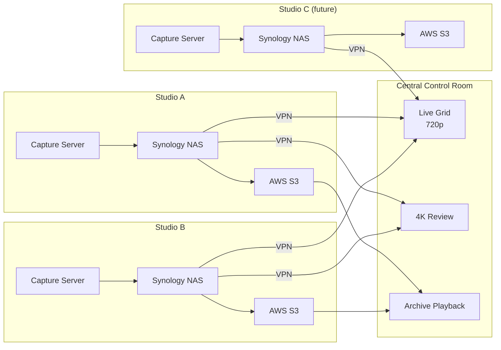

# System Architecture

## Overview

Each studio operates as a self-contained capture unit. The central control room connects to all studios via site-to-site VPN and can monitor or review any table across any studio. Cloud storage provides long-term archival and offsite playback.

> **Diagram source:** [`../diagrams/system-topology.d2`](../diagrams/system-topology.d2)
> Compile with: `d2 diagrams/system-topology.d2 diagrams/system-topology.svg`


---

## Components

### Capture Server (per studio)

A dedicated Linux server responsible for running all capture containers for the studio's tables. Not the Synology — compute and storage are separated.

**HUD access:** The capture server accesses each table's HUD URL over the internal studio network. The HUD application uses IP allowlisting — the capture server's IP is whitelisted, and no session credentials or authentication tokens are required. This keeps the capture process stateless and removes any dependency on auth token refresh cycles during long-running sessions.

**Responsibilities:**
- Run one Docker container per table (see [Recording Pipeline](recording-pipeline.md))
- Encode both Track A (raw feed) and Track B (HUD) per table using HEVC or AV1 (hardware-dependent)
- Encode a 720p proxy stream per table for VPN live monitoring
- Write segments to Synology via NFSv4 mount
- Run the local watchdog health checker

**Minimum spec at launch (4 tables):**
- CPU: Intel Core i7 12th gen or better (QuickSync for HEVC encode)
- RAM: 32 GB (headless Chrome is ~1.5 GB per table; encode buffers)
- Network: 1GbE sufficient at 4 tables; plan 10GbE by Year 1

**Spec at Year 3 (~11 tables per studio):**
- CPU: Intel Xeon or AMD EPYC with integrated or discrete GPU for NVENC
- RAM: 64–128 GB
- Network: 10GbE to NAS

### Synology NAS (per studio)

Stores the hot tier (0–30 days). Acts as the NFS target for the capture server and the source for Cloud Sync to AWS.

**Launch config (4 tables):**
- Model: Synology DS923+ or RS-series equivalent
- Drives: 4× 8TB surveillance-grade (WD Purple or Seagate SkyHawk) in SHR-2
- Usable: ~16 TB — sufficient for 30-day hot window at launch
- Add NVMe SSD cache pair for read acceleration (mandatory for seek performance)

**Year 3 config (~11 tables per studio):**
- Expand to 12-bay chassis (RS3621xs+ or equivalent)
- 12× 16TB drives in RAID 6 → ~115 TB usable
- Dual 10GbE ports (LACP bonded)

### AWS Storage

Handles warm and cold tiers. Synology Cloud Sync manages the transfer automatically.

| Tier | Service | Retention Window | Access Latency |
|------|---------|-----------------|----------------|
| Warm | S3 Standard-IA | Days 30–90 | Minutes |
| Cold | S3 Glacier Instant Retrieval | Days 90–180 | Seconds–Minutes |
| Archive | S3 Glacier Deep Archive | Marked-for-retention only | Hours |

S3 Object Lock (Compliance mode) is applied at upload time. Default retention: 180 days. Marked-for-retention content gets an extended or indefinite lock.

---

## Multi-Studio Topology

Each studio is autonomous — a VPN outage does not affect local recording. The control room loses live monitoring visibility but recordings continue uninterrupted.



---

## File Organization

```
/volume1/recordings/
  {studio_id}/
    {table_id}/
      track_a_raw/          ← raw video feed
        2026-04-02/
          14-00-00.mp4      ← 1-hour segment (closed, readable)
          14-00-00.sha256   ← segment checksum
          15-00-00.mp4      ← currently writing
      track_b_hud/          ← HUD screen capture
        2026-04-02/
          14-00-00.mp4
          14-00-00.sha256
      track_b_hud_duplicate/  ← high-value content only (see high-value-content.md)
      metadata/             ← structured log data (chat, instructions, events)
        2026-04-02/
          14-00-00.jsonl
```

Jumping to a specific time is a file path lookup: `/{studio}/{table}/track_a_raw/{date}/{hour}.mp4`, seek to offset = (target_minute × 60 + target_second).
