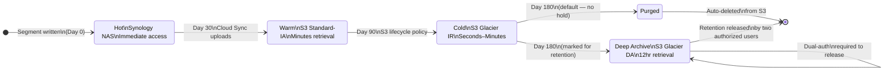

# Data Retention Policy

## Retention Tiers

All recordings follow a default 180-day lifecycle. Content can be marked for extended or indefinite retention by authorized control room staff.



### Tier Definitions

| Tier | Storage Class | Days | Retrieval | Use Case |
|------|-------------|------|-----------|----------|
| Hot | Synology NAS (local) | 0–30 | Immediate | Active review, recent incidents |
| Warm | AWS S3 Standard-IA | 30–90 | Minutes | Recent dispute resolution |
| Cold | AWS S3 Glacier Instant Retrieval | 90–180 | Seconds–Minutes | Compliance window, periodic audit |
| Archive | AWS S3 Glacier Deep Archive | 180+ | 12 hours | Marked-for-retention only |
| Purge | — | 180+ (default) | — | Auto-deleted, no exception |

---

## S3 Lifecycle Configuration

```json
{
  "Rules": [
    {
      "ID": "recording-lifecycle",
      "Status": "Enabled",
      "Filter": { "Prefix": "recordings/" },
      "Transitions": [
        { "Days": 30, "StorageClass": "STANDARD_IA" },
        { "Days": 90, "StorageClass": "GLACIER_IR" }
      ],
      "Expiration": { "Days": 180 }
    },
    {
      "ID": "retained-content",
      "Status": "Enabled",
      "Filter": { "Tag": { "Key": "retention", "Value": "hold" } },
      "Transitions": [
        { "Days": 30, "StorageClass": "STANDARD_IA" },
        { "Days": 90, "StorageClass": "GLACIER_IR" },
        { "Days": 180, "StorageClass": "DEEP_ARCHIVE" }
      ]
    }
  ]
}
```

---

## S3 Object Lock (Tamper-Proof Storage)

All uploads use S3 Object Lock in **Compliance mode**. This prevents any deletion or modification — including by bucket owners and AWS root — until the retention period expires.

```
Default lock: 180 days from upload date
Marked-for-retention: Lock extended to date set by authorized user
```

Checksums (`.sha256` sidecar files) are uploaded alongside each video segment and are subject to the same Object Lock.

---

## Marking Content for Retention

Authorized control room staff can mark any segment or session for extended retention through the control room back office UI. This:

1. Applies the `retention=hold` S3 tag to all segments in the session window
2. Extends the Object Lock retention date
3. Logs the action with: who marked it, when, and the stated reason

Retention marking is an **append-only audit action** — it cannot be reversed by the same user who applied it. A second authorized user must approve removal of a hold.

---

## High-Value Content Duplication

For sessions designated high-value (see [High-Value Content](high-value-content.md)):

- A duplicate recording is written to a **separate physical path** on the NAS during capture
- The duplicate follows its own S3 upload path (separate prefix/bucket)
- If the session is later cleared (not marked for retention), the duplicate is discarded on the same schedule as the primary
- If the session is marked for retention, both the primary and duplicate are held

This protects against a single file corruption or a NAS drive failure during the 30-day hot window.

---

## Audit Log

All retention decisions are immutable and stored in a separate audit table:

```jsonl
{"ts":"2026-04-02T14:30:00Z","action":"mark_retention","user":"ops@control","studio":"studio-a","table":"table-02","session_start":"2026-04-02T12:00:00Z","session_end":"2026-04-02T14:00:00Z","reason":"Player dispute - high wager round"}
{"ts":"2026-04-02T22:00:00Z","action":"auto_purge","system":"lifecycle","studio":"studio-a","table":"table-01","segment":"2026-01-01/00-00-00.mp4"}
```
