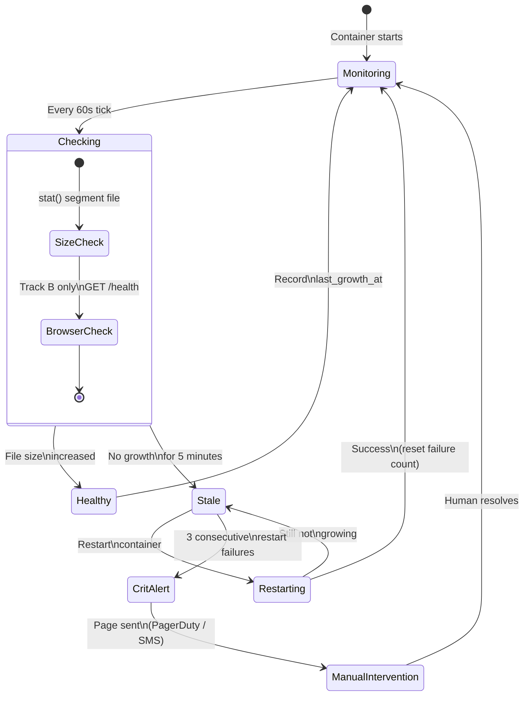

# Monitoring & Watchdog

## Requirements

A 24/7 unattended capture system requires automated failure detection and recovery. A missed hour of recording may be unrecoverable — the watchdog is not optional.

---

## What Can Fail

| Component | Failure Mode | Detection Signal | Recovery Action |
|-----------|-------------|-----------------|-----------------|
| FFmpeg process | Crash, hang, frame freeze | File size not growing | Restart container |
| Chromium (HUD) | Memory leak, crash, blank page | Browser health endpoint | Restart browser only |
| NFS mount | Stale mount, network drop | Write failure on mount path | Remount + alert |
| Synology NAS | Drive failure, storage full | SMART events, disk usage | Alert (no auto-recovery) |
| AWS Cloud Sync | Upload lag | Sync age > threshold | Alert |
| Capture server | Reboot, kernel panic | All streams down | Alert (requires human) |

---

## Watchdog State Machine



## Watchdog Service

A Go service runs on each capture server. It monitors all active capture containers and acts as the primary health enforcement layer.

### Health Check Logic (Per Container)

```go
type StreamHealth struct {
    StudioID  string
    TableID   string
    TrackA    TrackHealth
    TrackB    TrackHealth
}

type TrackHealth struct {
    LastSegmentPath string
    LastCheckedSize int64
    LastGrowthAt    time.Time
    Status          HealthStatus // OK, STALE, DEAD
}

// Check runs every 60 seconds per stream
func (w *Watchdog) Check(ctx context.Context, stream StreamHealth) {
    for _, track := range []TrackHealth{stream.TrackA, stream.TrackB} {
        current := fileSize(track.LastSegmentPath)
        if current > track.LastCheckedSize {
            track.LastGrowthAt = time.Now()
            track.Status = OK
        } else if time.Since(track.LastGrowthAt) > 5*time.Minute {
            track.Status = STALE
            w.restart(stream) // restart container
            w.alert(stream, "stream stale, restarted")
        }
    }
}
```

### Browser-Specific Health Check

Chromium gets its own lighter check. The HUD website exposes a `/health` endpoint that returns `{"status":"ok"}` when the page is fully rendered. The watchdog polls this every 30 seconds:

```go
func (w *Watchdog) CheckBrowser(containerID string, hudURL string) {
    resp, err := http.Get(hudURL + "/health")
    if err != nil || resp.StatusCode != 200 {
        w.restartBrowser(containerID)
        // FFmpeg continues — only browser is restarted
        // Track A (raw feed) is completely unaffected
        // Track B gap: ~30 seconds during browser restart
    }
}
```

### Scheduled Browser Restart

Every day at 03:00 local time, all browsers are gracefully restarted to clear memory leaks. This is coordinated — browsers restart one at a time with 30-second gaps to avoid simultaneous Track B gaps across all tables:

```bash
# cron: 0 3 * * *
for TABLE in $(list_tables); do
  restart_browser "${TABLE}"
  sleep 30
done
```

---

## Alerting

Alerts are sent via the platform's existing alerting channel (PagerDuty / SMS). Alert levels:

| Level | Condition | Response SLA |
|-------|-----------|-------------|
| `WARN` | Single stream stale, auto-restarted | Acknowledge within 4 hours |
| `WARN` | Synology disk usage > 80% | Acknowledge within 24 hours |
| `CRIT` | Single stream still dead after 3 restart attempts | Acknowledge within 30 min |
| `CRIT` | All streams on a capture server down | Immediate page |
| `CRIT` | NFS mount failure | Immediate page |
| `CRIT` | Synology disk usage > 95% | Immediate page |

---

## Metrics Dashboard

The watchdog exposes a `/metrics` endpoint (Prometheus format) consumed by the control room monitoring dashboard:

```
# Gauges
surveillance_stream_healthy{studio,table,track}  1 or 0
surveillance_segment_age_seconds{studio,table,track}  seconds since last file growth
surveillance_nas_disk_usage_pct{studio}  percentage

# Counters
surveillance_restarts_total{studio,table,reason}
surveillance_alerts_total{studio,level}
```

---

## Synology SMART Monitoring

The Synology NAS sends SNMP traps or email alerts on:
- Drive SMART failure prediction
- RAID degradation (a drive has failed or been removed)
- Volume nearly full (configurable threshold, recommend 80%)

These are integrated into the same alerting channel as the watchdog.

---

## Recovery Runbook

**Scenario: Single stream is dead, watchdog has restarted it 3 times with no recovery**

1. SSH to capture server
2. `docker logs capture-table-{id}` — identify the failure (FFmpeg error, NFS write error, OOM)
3. If NFS: `mount | grep nas` — check if mount is active; `umount -l /mnt/nas && mount /mnt/nas`
4. If OOM: reduce `-crf` value or check for other runaway processes
5. If FFmpeg error: check RTSP source is still reachable
6. Manually restart container: `docker restart capture-table-{id}`
7. Verify file size begins growing within 60 seconds

**Scenario: Synology disk > 95%**

1. Check Cloud Sync status — if upload is lagging, segments may be piling up locally
2. Check for orphaned temp files in NAS `/volume1/recordings/@tmp`
3. If Cloud Sync is healthy and disk is still full, this is a capacity event — add drives
4. Do NOT delete recordings manually to free space — this bypasses retention policy and audit log
