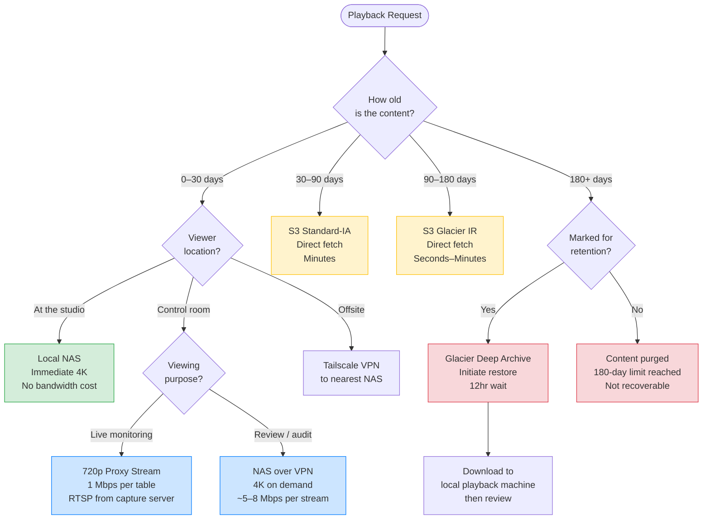

# Playback System

## Playback Modes

Three playback modes depending on where the reviewer is and what they need to access:

| Mode | Location | Source | Latency | Use Case |
|------|----------|--------|---------|----------|
| **Onsite** | At the studio | Local Synology | Immediate | Day-of review, incident response |
| **Remote (VPN)** | Control room or offsite | Studio Synology via VPN | Depends on VPN/WAN | Cross-studio review, management oversight |
| **Archive** | Anywhere | AWS S3 / Glacier | Minutes (S3-IA), Seconds (Glacier IR) | Disputes, compliance, historical review |



---

## Time Navigation

Recordings are segmented into 1-hour files. Jumping to a specific time is a two-step file lookup:

1. **Select the file:** `/{studio}/{table}/track_b_hud/{date}/{hour}.mp4`
2. **Seek within the file:** offset in seconds = `(target_minute × 60) + target_second`

**Example:** Jump to 2:47 PM on April 2, 2026 for Studio A, Table 3:
```
File:   /mnt/nas/studio-a/table-03/track_b_hud/2026-04-02/14-00-00.mp4
Offset: (47 × 60) + 0 = 2820 seconds
```

This lookup is identical whether the file is on local NAS or pulled from S3 — the control room back office handles the path resolution and surfacing the correct URI.

---

## Live vs. Active-Segment Playback

The current hour's segment is still being written by FFmpeg. Behavior depends on file format:

- **Closed segments** (any completed hour): Open instantly, seek freely. No conflicts with the writer.
- **Active segment** (current hour): The file does not yet have its `moov` atom written. Standard players will refuse to open it. **Do not attempt live playback of the active segment.** For live monitoring, use the proxy RTSP stream instead.

**Live monitoring (720p proxy):** The capture server exposes a 720p RTSP stream per table at:
```
rtsp://{capture-server-ip}:8554/{studio}/{table}/proxy
```
This is suitable for the control room grid display — low bandwidth, real-time, no seeking.

---

## Simultaneous Read/Write

The Synology NAS handles simultaneous writes (capture server) and reads (playback) via NFSv4. Key behaviors:

- **Closed segments:** Multiple readers can open the same file concurrently with no impact on the writer
- **NVMe SSD cache:** Absorbs random reads (seek operations) so HDD heads remain optimized for sequential writes
- **No NVR software needed:** Direct file access via NFS is more efficient and avoids per-camera licensing costs

A single playback session pulling one 4K HEVC stream consumes ~5 Mbps from the NAS — a negligible fraction of the NAS's 10GbE capacity.

---

## Remote Playback (Control Room / VPN)

The control room connects to all studio NAS units via site-to-site VPN. Remote playback works identically to onsite — the NAS NFS path is mounted on the control room playback machine.

**Bandwidth requirement per 4K stream over VPN:** ~5–8 Mbps. The control room's VPN uplink from each studio must support this per concurrent playback session.

For **multi-stream review** (watching several tables simultaneously over VPN), use the 720p proxy streams — they are designed for this and consume 1 Mbps each.

**Recommended playback software:**
- **MPV:** Best handling of high-bitrate HEVC and large file seeking. Highly scriptable for integration with the control room UI.
- **VLC:** Acceptable fallback. Can struggle with seeking in large HEVC files.

---

## Archive Playback (AWS)

For content older than 30 days (no longer on local NAS):

| Tier | Retrieval | Steps |
|------|-----------|-------|
| S3 Standard-IA (30–90 days) | Direct download, minutes | Presigned URL or S3 SDK fetch |
| S3 Glacier Instant Retrieval (90–180 days) | Seconds–minutes | Direct fetch, no restore job needed |
| S3 Glacier Deep Archive (marked-for-retention) | 12–48 hours | Initiate restore job → download when ready |

The control room back office UI handles this transparently: if a requested segment is in Glacier Deep Archive, the UI initiates the restore and notifies the user when the file is available.

**Checksum verification on retrieval:** All downloads are verified against the `.sha256` sidecar before playback. A mismatch halts playback and triggers an integrity alert.

---

## Control Room Back Office Integration

The playback system integrates into the existing control room back office application:

- **Table/time picker:** Studio → Table → Date → Hour → seek to minute:second
- **Track selector:** Toggle between Track A (raw feed) and Track B (HUD capture)
- **Metadata overlay:** Display timestamped chat/teleprompter/instruction log alongside video
- **Retention marking:** Mark session for hold from within the playback UI
- **Tier indicator:** Show where the file lives (Hot/Warm/Cold/Archive) and estimated retrieval time
- **Integrity status:** Show checksum verification result per segment
