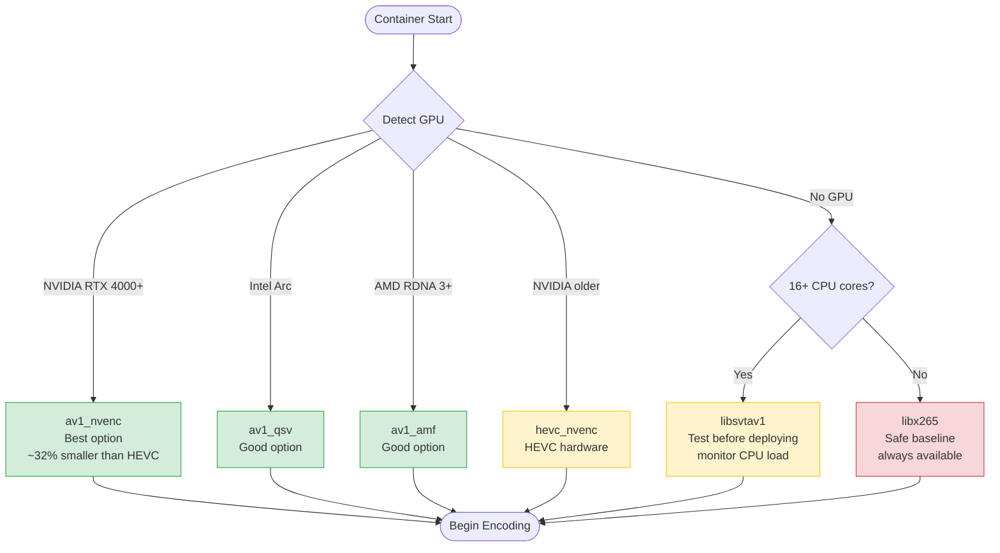

# Recording Pipeline

## Overview

Each table produces two recording tracks simultaneously:

| Track | Source | Purpose |
|-------|--------|---------|
| **Track A — Raw Feed** | RTSP/HLS stream from studio camera | Game integrity (hardware-sourced, no rendering layer) |
| **Track B — HUD Capture** | Headless browser rendering the HUD website | Presenter review (what was actually displayed) |

A third **proxy stream** (720p) is generated from the HUD capture for real-time monitoring over VPN without consuming bandwidth budgeted for 4K.

---

## Container Architecture

One Docker container per table. Each container runs three processes in a supervised process group.

> **Diagram source:** [`../diagrams/recording-pipeline.d2`](../diagrams/recording-pipeline.d2)
> Compile with: `d2 diagrams/recording-pipeline.d2 diagrams/recording-pipeline.svg`


---

## Container Entrypoint

```bash
#!/usr/bin/env bash
set -euo pipefail

DISPLAY_NUM=":${DISPLAY_ID}"
STUDIO="${STUDIO_ID}"
TABLE="${TABLE_ID}"
HUD_URL="${HUD_URL}"
RTSP_URL="${RTSP_URL}"
NAS_MOUNT="/mnt/nas/${STUDIO}/${TABLE}"
DATE=$(date +%Y-%m-%d)
HOUR=$(date +%H-%M-%S)

# 1. Start virtual 4K display
Xvfb "${DISPLAY_NUM}" -screen 0 3840x2160x24 -nolisten tcp &

# 2. Launch Chromium on virtual display (no GPU, no sandbox for container)
DISPLAY="${DISPLAY_NUM}" chromium-browser \
  --no-sandbox \
  --disable-gpu \
  --window-size=3840,2160 \
  --window-position=0,0 \
  --kiosk \
  --noerrdialogs \
  --disable-session-crashed-bubble \
  --disable-infobars \
  "${HUD_URL}" &

# Allow browser to render before encoding starts
sleep 5

SEGMENT_PATTERN="%Y-%m-%d/%H-%M-%S.mp4"

# 3. Track A: Pull raw RTSP feed directly — no browser involved
ffmpeg -rtsp_transport tcp \
  -i "${RTSP_URL}" \
  -c:v libx265 -preset ultrafast -crf 28 \
  -r 10 \
  -f segment -segment_time 3600 -reset_timestamps 1 \
  -strftime 1 \
  -segment_list "${NAS_MOUNT}/track_a_raw/segments.m3u8" \
  "${NAS_MOUNT}/track_a_raw/${SEGMENT_PATTERN}" &

# 4. Track B: Capture HUD from virtual display
ffmpeg -f x11grab -display_name "${DISPLAY_NUM}" \
  -video_size 3840x2160 -framerate 10 \
  -i "${DISPLAY_NUM}" \
  -c:v libx265 -preset ultrafast -crf 28 \
  -f segment -segment_time 3600 -reset_timestamps 1 \
  -strftime 1 \
  -segment_list "${NAS_MOUNT}/track_b_hud/segments.m3u8" \
  "${NAS_MOUNT}/track_b_hud/${SEGMENT_PATTERN}" &

# 5. Proxy stream: 720p for VPN live monitoring (RTSP output for control room)
ffmpeg -f x11grab -display_name "${DISPLAY_NUM}" \
  -video_size 3840x2160 -framerate 10 \
  -i "${DISPLAY_NUM}" \
  -vf scale=1280:720 \
  -c:v libx264 -preset ultrafast -b:v 1000k \
  -f rtsp "rtsp://0.0.0.0:8554/${STUDIO}/${TABLE}/proxy" &

wait
```

---

## Segment Checksum Generation

A sidecar process watches for newly closed segments and writes SHA-256 checksums:

```bash
# Runs as a separate process in the container
inotifywait -m -e close_write "${NAS_MOUNT}" -r --format '%w%f' |
while read -r filepath; do
  if [[ "${filepath}" == *.mp4 ]]; then
    sha256sum "${filepath}" > "${filepath%.mp4}.sha256"
  fi
done
```

Checksums are written to S3 alongside the video files and are verified on retrieval.

---

## Browser Memory Management

Chromium develops memory leaks when running for days. A scheduled restart at 03:00 local time prevents degradation without losing recordings (Track A is independent; Track B has at most a 30-second gap during browser restart):

```bash
# Runs via cron inside container (or via Docker restart policy + scheduled task)
0 3 * * * pkill chromium; sleep 5; DISPLAY=:99 chromium --kiosk "${HUD_URL}" &
```

The container itself uses `restart: always` in Docker Compose as a secondary safety net.

---

## Codec Selection: HEVC vs AV1

### Default: HEVC (H.265)

HEVC is the baseline codec. It has broad hardware encoder support, is well-understood, and all playback software (MPV, VLC, Synology, browsers) handles it without issues.

### Preferred if available: AV1

AV1 delivers approximately 30–40% better compression than HEVC at equivalent quality. At our bitrate targets, this translates directly to smaller files and lower S3 costs — with no sacrifice in playback quality. The tradeoff is that hardware AV1 encoders are limited to newer GPU generations.

| Codec | Bitrate (Track B HUD) | Daily/table | 30-day/table | Savings vs HEVC |
|-------|----------------------|------------|-------------|-----------------|
| HEVC | ~3 Mbps | ~32 GB | ~960 GB | baseline |
| AV1 | ~2 Mbps | ~22 GB | ~648 GB | ~32% |

**Use AV1 when the capture server has one of:**
- NVIDIA RTX 4000 series or later (`av1_nvenc`) — most performant option
- Intel Arc GPU (`av1_qsv`) — available in newer NUC/workstation platforms
- AMD RDNA 3 or later (`av1_amf`)

**Do not use software AV1 (`libaom-av1`) for real-time capture** — it is far too slow for 4K at any useful preset. SVT-AV1 (`libsvtav1`) is faster and may be viable at 10fps on a high-core-count CPU, but hardware encode is strongly preferred for 24/7 reliability.

**FFmpeg AV1 variants:**

```bash
# NVIDIA RTX 4000+ (recommended)
-c:v av1_nvenc -preset p4 -rc vbr -cq 30

# Intel Arc (QSV)
-c:v av1_qsv -global_quality 30 -look_ahead 1

# AMD RDNA 3+ (AMF)
-c:v av1_amf -quality balanced -qvbr_quality_level 30

# CPU fallback — only viable at 10fps on 16+ core systems, test before deploying
-c:v libsvtav1 -preset 8 -crf 32
```

The container entrypoint should detect available hardware at startup and select the best available encoder automatically, falling back to `libx265` if no hardware AV1 is present.



**Playback compatibility:** AV1 is supported natively in MPV, VLC 3.0+, all major browsers, and Synology DSM 7+. No additional configuration is needed on the playback side.

### GPU Acceleration (HEVC)

If AV1 is not available but the server has a GPU, use NVENC for HEVC:

```bash
-c:v hevc_nvenc -preset p4 -rc vbr -cq 28
```

One RTX 3060 or better handles 10+ HEVC streams at 10fps/4K simultaneously. For Year 3 (~11 tables per studio) a single mid-range GPU covers the full studio load. An RTX 4070 or better enables AV1 encode for all streams instead.

---

## Docker Compose (per studio)

```yaml
version: "3.9"

x-capture-defaults: &capture-defaults
  image: game-surveillance/capture:latest
  restart: always
  network_mode: host
  privileged: true  # required for Xvfb and x11grab
  volumes:
    - /mnt/nas:/mnt/nas

services:
  capture-table-01:
    <<: *capture-defaults
    environment:
      DISPLAY_ID: "99"
      STUDIO_ID: "studio-a"
      TABLE_ID: "table-01"
      HUD_URL: "https://hud.internal/table/01"
      RTSP_URL: "rtsp://camera.studio-a.internal/table-01"

  capture-table-02:
    <<: *capture-defaults
    environment:
      DISPLAY_ID: "100"
      STUDIO_ID: "studio-a"
      TABLE_ID: "table-02"
      HUD_URL: "https://hud.internal/table/02"
      RTSP_URL: "rtsp://camera.studio-a.internal/table-02"
  # ... repeat per table
```

Each container uses a unique `DISPLAY_ID` to isolate its virtual display.

---

## Structured Metadata (Track C)

Chat messages, teleprompter content, and game instructions are logged as JSONL alongside the video segments. This is cheaper than burning them into pixels, fully searchable, and timestamp-aligned with the video segments:

```jsonl
{"ts":"2026-04-02T14:23:07Z","type":"chat","player_id":"p-123","message":"nice hand"}
{"ts":"2026-04-02T14:23:09Z","type":"instruction","content":"Deal second card now"}
{"ts":"2026-04-02T14:23:11Z","type":"teleprompter","content":"Welcome back from break"}
```

File path mirrors the video segments: `metadata/2026-04-02/14-00-00.jsonl`
